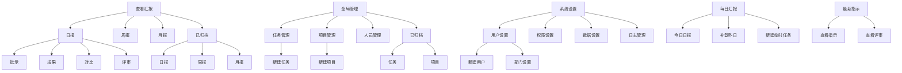
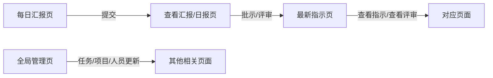

## 1. 产品概述

贝洛菲科技团队管理系统是一款专注于**结果管理、成果管理、项目交付管理**的Web管理工具。核心目标是"不管理人，只管理结果"，打造集项目全生命周期管理、任务量化追踪、日报/周报汇报与多角色权限管控于一体的团队管理平台。

- **核心价值**：通过量化指标追踪团队工作成果，提升项目交付效率
- **目标用户**：企业管理层、部门负责人、项目成员
- **系统要求**：低学习成本、完美适配电脑端和手机端、支持上传图片/视频/文档/链接

## 2. 三级导航结构

## 3. 用户角色与权限

### 3.1 预设部门

外贸部、行政部、技术部、回收部、管理层

### 3.2 预设用户

| 用户名 | 昵称 | 部门 | 密码 |
|--------|------|------|------|
| roman | 梁总 | 管理层 | Belofy2026 |
| laochen | 老陈 | 管理层 | Belofy2026 |
| golden | 小秦 | 技术部 | Belofy2026 |
| shilong | 世龙 | 技术部 | Belofy2026 |
| zhijun | 梓君 | 行政部 | Belofy2026 |

### 3.3 导航栏可见性权限

| 用户 | 可见导航 |
|------|----------|
| roman | 查看汇报、全局管理、系统设置 |
| laochen | 查看汇报、全局管理、系统设置、每日汇报、最新指示 |
| golden | 每日汇报、最新指示 |
| shilong | 每日汇报、最新指示 |
| zhijun | 查看汇报 |

## 4. 页面内容详情

### 4.1 查看汇报模块

| 页面 | 内容描述 |
|------|----------|
| 日报 | 按人员分组的日报卡片，包含：任务名称、任务类型、任务状态、完成量化数、单位工时、所用工时、任务进度；操作：批示按钮、对比按钮、删除按钮、待评审按钮（满足条件才出现） |
| 周报 | 按人员分组的周报卡片，包含：任务名称、任务类型、本周完成量化数（从日报汇总）、任务进度；操作：对比按钮 |
| 月报 | 按人员分组的月报卡片，包含：提交日报数量、项目数、任务数、本月完成量化数 |
| 已归档 | 日报按钮、周报按钮、月报按钮（切换查看归档内容） |

### 4.2 全局管理模块

| 页面 | 内容描述 |
|------|----------|
| 任务管理 | 新建任务按钮，按人员和任务类型分组的任务卡片，包含：任务名称、任务状态、进度百分比、完成数/量化总数；操作：编辑按钮、删除按钮 |
| 项目管理 | 新建项目按钮，项目卡片包含：项目名称、项目状态、负责人、进度百分比、任务数量；操作：编辑按钮、删除按钮、评审按钮（满足条件才出现） |
| 人员管理 | 人员卡片，包含：参与项目、负责的任务、任务总工时、负荷、提交日报数量、任务平均分、绩效评分 |
| 已归档 | 任务、项目（查看已归档的任务和项目） |

### 4.3 系统设置模块

| 页面 | 内容描述 |
|------|----------|
| 用户设置 | 新建用户按钮、部门设置按钮，用户卡片包含：用户名、昵称、部门；操作：编辑按钮、删除按钮 |
| 权限设置 | 权限列表、人员列表（导航栏可见性配置） |
| 数据设置 | 负荷计算公式设置、绩效评分权重设置、本月上班天数 |
| 日志管理 | 日志列表、筛选下拉选框、导出按钮 |

### 4.4 每日汇报模块

| 页面 | 内容描述 |
|------|----------|
| 今日日报 | 按任务类型分组的任务卡片，包含：任务名称、任务进度、完成量化数（仅显示自己负责或参与的项目和任务） |
| 补登昨日 | 按任务类型分组的任务卡片，包含：任务名称、任务进度、完成量化数 |
| 新建临时任务 | 任务名称、优先级、状态、目标数量、单位、已完成、工时/单位、开始/结束时间、描述、提交按钮 |

### 4.5 最新指示模块

| 页面 | 内容描述 |
|------|----------|
| 查看指示 | 按任务类型分组的任务卡片，包含：任务名称、指示内容（来自日报批示） |
| 查看评审 | 项目卡片或任务卡片，包含：项目/任务名称、评审结果 |

## 5. 数据模型定义

### 5.1 任务类型

- 项目任务
- 日常任务
- 临时任务

### 5.2 任务状态

- 进行中
- 已完成
- 待修改
- 已延期
- 待评审
- 已评审

### 5.3 项目状态

- 待立项
- 进行中
- 待评审
- 已评审
- 已延期

### 5.4 任务优先级

- P1（紧急/红色）
- P2（一般/橙色）
- P3（普通/蓝色）

### 5.5 评审等级

| 分数范围 | 等级 |
|----------|------|
| 90-100 | 优秀 |
| 80-89 | 良好 |
| 70-79 | 一般 |
| 60-69 | 合格 |
| ≤59 | 不合格 |

### 5.6 项目/任务成果

图片、视频、文档、链接

## 6. 核心业务规则

### 6.1 项目与任务关系

- 项目包含：总负责人、项目成员
- 任务包含：任务负责人、任务组员
- 任务负责人和任务组员自动成为相应项目的项目成员
- 任务负责人若与项目总负责人为同一人，则在项目里列为总负责人

### 6.2 项目进度自动计算

项目进度 = 该项目下所有任务的量化单位总和（自动计算，而非手工填写）

### 6.3 人员负荷计算

人员负荷 = (任务量化数 × 工时单位) / 40 × 100%
- 总工时 = 40小时为100%
- 超过或低于则自动计算百分比

### 6.4 绩效评分计算（每月一次）

| 指标 | 权重 | 计算规则 |
|------|------|----------|
| 日报 | 30分 | 每天一次×当月上班天数，缺一次扣2分 |
| 任务准时率 | 30分 | 任务在规定时间内完成满分，每延期1天扣2分 |
| 任务评审结果 | 40分 | 一般一次扣3分，合格一次扣5分，不合格一次扣20分 |

## 7. 页面内联同步关系

- 每日汇报页提交的内容自动同步到查看汇报/日报页
- 查看汇报/日报的批示、评审内容自动同步到最新指示页/查看指示或查看评审页
- 全局管理页的任务、项目、人员更新自动同步到其他相关页面

## 8. 设计规范

### 8.1 设计风格

- 高级美观的视觉设计，紧凑工整布局
- 卡片式布局，禁止复杂表格
- 禁止传统ERP风格

### 8.2 交互规范

- **零跳转原则**：除登录页外，全站为单页应用（SPA）视觉体验
- **抽屉式纵深**：点击任何卡片、列表行、或"新建"按钮，统一居中弹出宽度固定的抽屉面板
- **二次确认**：删除操作均触发气泡确认（Popconfirm），绝不弹窗打断

### 8.3 响应式设计

- 完美适配电脑端和手机端
- 桌面端：左侧导航栏 + 右侧内容区域
- 移动端：底部导航栏，抽屉式菜单