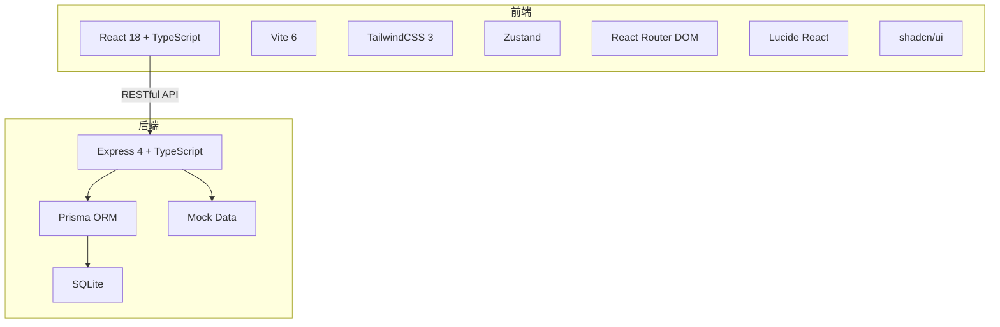
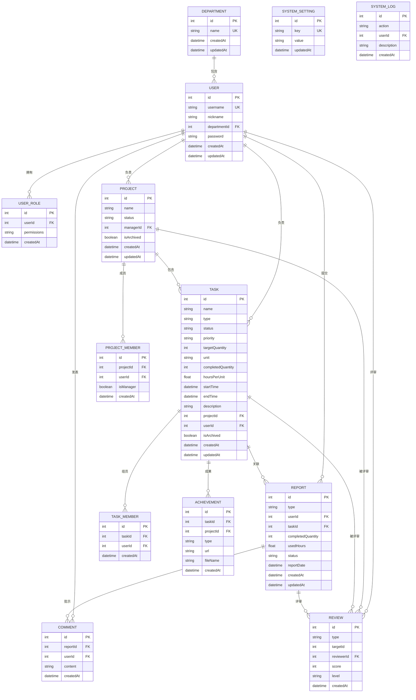
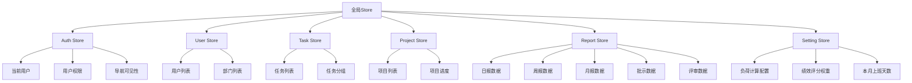

## 1. 架构设计



## 2. 技术描述

### 2.1 前端技术栈（成熟稳定方案）

| 技术 | 版本 | 选型理由 |
|------|------|----------|
| React | 18.x | 业界最成熟的前端框架，生态完善，社区活跃，长期支持 |
| TypeScript | 5.x | 成熟的类型安全方案，提升代码可维护性和开发效率 |
| Vite | 6.x | 成熟的构建工具，快速冷启动和热更新，生态完善 |
| TailwindCSS | 3.x | 成熟的原子化CSS框架，开发效率高，生态丰富 |
| shadcn/ui | latest | 基于 Radix UI 的成熟组件库，注重可访问性和稳定性 |
| Zustand | 4.x | 轻量级成熟状态管理方案，API简洁，性能优秀 |
| React Router DOM | 6.x | 业界标准的路由方案，成熟稳定，API清晰 |
| Lucide React | latest | 成熟的图标库，轻量级，风格统一 |

### 2.2 后端技术栈（成熟稳定方案）

| 技术 | 版本 | 选型理由 |
|------|------|----------|
| Express | 4.x | 业界最成熟的 Node.js 框架，生态完善，文档丰富 |
| TypeScript | 5.x | 类型安全，提升后端代码质量和可维护性 |
| Prisma | 5.x | 成熟的 ORM 工具，类型安全查询，迁移管理完善 |
| SQLite | latest | 轻量级嵌入式数据库，适合本地开发和小型项目 |
| jsonwebtoken | latest | 成熟的 JWT 认证方案，广泛使用 |
| bcrypt | latest | 成熟的密码哈希方案，安全可靠 |

### 2.3 开发工具

| 工具 | 用途 |
|------|------|
| ESLint | 代码规范检查 |
| Prettier | 代码格式化 |
| Vitest | 单元测试 |
| PostCSS | CSS 处理 |

### 2.4 初始化模板

react-express-ts（基于 Vite 的全栈模板）

## 3. 路由定义

| 路由 | 页面组件 | 层级 | 权限要求 |
|------|----------|------|----------|
| /login | Login | 登录页 | 无 |
| /dashboard | Dashboard | - | 所有用户 |
| /reports/daily | DailyReports | 一级→二级 | 查看汇报权限 |
| /reports/daily/comment | DailyComment | 一级→二级→三级 | 查看汇报权限 |
| /reports/daily/achievement | DailyAchievement | 一级→二级→三级 | 查看汇报权限 |
| /reports/daily/compare | DailyCompare | 一级→二级→三级 | 查看汇报权限 |
| /reports/daily/review | DailyReview | 一级→二级→三级 | 查看汇报权限 |
| /reports/weekly | WeeklyReports | 一级→二级 | 查看汇报权限 |
| /reports/monthly | MonthlyReports | 一级→二级 | 查看汇报权限 |
| /reports/archived | ArchivedReports | 一级→二级 | 查看汇报权限 |
| /management/tasks | TaskManagement | 一级→二级 | 全局管理权限 |
| /management/tasks/create | CreateTask | 一级→二级→三级 | 全局管理权限 |
| /management/projects | ProjectManagement | 一级→二级 | 全局管理权限 |
| /management/projects/create | CreateProject | 一级→二级→三级 | 全局管理权限 |
| /management/people | PeopleManagement | 一级→二级 | 全局管理权限 |
| /management/archived | ManagementArchived | 一级→二级 | 全局管理权限 |
| /settings/users | UserSettings | 一级→二级 | 系统设置权限 |
| /settings/users/create | CreateUser | 一级→二级→三级 | 系统设置权限 |
| /settings/users/departments | DepartmentSettings | 一级→二级→三级 | 系统设置权限 |
| /settings/permissions | PermissionSettings | 一级→二级 | 系统设置权限 |
| /settings/data | DataSettings | 一级→二级 | 系统设置权限 |
| /settings/logs | LogSettings | 一级→二级 | 系统设置权限 |
| /daily-report | TodayReport | 一级→二级 | 每日汇报权限 |
| /daily-report/yesterday | YesterdayReport | 一级→二级 | 每日汇报权限 |
| /daily-report/temp-task | TempTask | 一级→二级 | 每日汇报权限 |
| /notifications | Notifications | 一级 | 最新指示权限 |
| /notifications/comment | ViewComment | 一级→二级 | 最新指示权限 |
| /notifications/review | ViewReview | 一级→二级 | 最新指示权限 |

## 4. API定义

### 4.1 用户相关

| 方法 | 路径 | 描述 |
|------|------|------|
| POST | /api/auth/login | 用户登录 |
| GET | /api/auth/me | 获取当前用户 |
| GET | /api/users | 获取用户列表 |
| POST | /api/users | 创建用户 |
| PUT | /api/users/:id | 更新用户 |
| DELETE | /api/users/:id | 删除用户 |

### 4.2 部门相关

| 方法 | 路径 | 描述 |
|------|------|------|
| GET | /api/departments | 获取部门列表 |
| POST | /api/departments | 创建部门 |
| PUT | /api/departments/:id | 更新部门 |
| DELETE | /api/departments/:id | 删除部门 |

### 4.3 任务相关

| 方法 | 路径 | 描述 |
|------|------|------|
| GET | /api/tasks | 获取任务列表 |
| POST | /api/tasks | 创建任务 |
| PUT | /api/tasks/:id | 更新任务 |
| DELETE | /api/tasks/:id | 删除任务 |
| GET | /api/tasks/user/:userId | 获取用户任务 |

### 4.4 项目相关

| 方法 | 路径 | 描述 |
|------|------|------|
| GET | /api/projects | 获取项目列表 |
| POST | /api/projects | 创建项目 |
| PUT | /api/projects/:id | 更新项目 |
| DELETE | /api/projects/:id | 删除项目 |
| GET | /api/projects/user/:userId | 获取用户项目 |
| POST | /api/projects/:id/review | 评审项目 |

### 4.5 日报相关

| 方法 | 路径 | 描述 |
|------|------|------|
| GET | /api/reports/daily | 获取日报列表 |
| POST | /api/reports/daily | 提交日报 |
| PUT | /api/reports/daily/:id | 更新日报 |
| DELETE | /api/reports/daily/:id | 删除日报 |
| POST | /api/reports/daily/:id/comment | 添加批示 |
| POST | /api/reports/daily/:id/review | 评审日报 |

### 4.6 周报/月报相关

| 方法 | 路径 | 描述 |
|------|------|------|
| GET | /api/reports/weekly | 获取周报列表 |
| GET | /api/reports/monthly | 获取月报列表 |

### 4.7 成果上传

| 方法 | 路径 | 描述 |
|------|------|------|
| POST | /api/achievements | 上传成果（图片/视频/文档/链接） |
| GET | /api/achievements/task/:taskId | 获取任务成果 |

### 4.8 系统设置

| 方法 | 路径 | 描述 |
|------|------|------|
| GET | /api/settings/data | 获取数据设置 |
| PUT | /api/settings/data | 更新数据设置 |
| GET | /api/logs | 获取日志列表 |
| POST | /api/logs/export | 导出日志 |

### 4.9 绩效评分

| 方法 | 路径 | 描述 |
|------|------|------|
| GET | /api/performance/user/:userId | 获取用户绩效评分 |

## 5. 数据模型



## 6. 核心计算公式

### 6.1 项目进度自动计算

```
项目进度 = (Σ任务完成量化数 / Σ任务目标量化数) × 100%
```

### 6.2 人员负荷计算

```
人员负荷 = (Σ任务量化数 × 工时单位) / 40 × 100%
基准：40小时 = 100%负荷
```

### 6.3 绩效评分计算（每月一次）

```
绩效评分 = 日报得分 + 任务准时率得分 + 任务评审得分

日报得分（30分）：
基础分 = 30分
扣分 = 缺日报次数 × 2分
实际得分 = max(0, 30 - 扣分)

任务准时率得分（30分）：
基础分 = 30分
扣分 = 延期天数 × 2分
实际得分 = max(0, 30 - 扣分)

任务评审得分（40分）：
基础分 = 40分
扣分规则：
- 一般：每次扣3分
- 合格：每次扣5分
- 不合格：每次扣20分
实际得分 = max(0, 40 - 扣分)
```

### 6.4 评审等级判定

```
90-100 → 优秀
80-89 → 良好
70-79 → 一般
60-69 → 合格
≤59 → 不合格
```

## 7. 全局状态管理设计（Zustand）



### 7.1 页面内联同步机制

| 触发操作 | 同步目标 | 说明 |
|----------|----------|------|
| 每日汇报提交 | 查看汇报/日报页 | 日报数据更新 |
| 日报批示 | 最新指示/查看指示 | 批示内容同步 |
| 项目/任务评审 | 最新指示/查看评审 | 评审结果同步 |
| 任务创建/更新 | 项目管理、人员管理 | 任务关联更新 |
| 项目创建/更新 | 任务管理、人员管理 | 项目关联更新 |
| 人员更新 | 任务管理、项目管理 | 人员关联更新 |

## 8. 动态导航权限渲染

### 8.1 权限配置结构

```typescript
interface NavigationPermission {
  userId: number;
  visibleMenus: string[];
}

interface MenuItem {
  id: string;
  name: string;
  icon: string;
  path: string;
  children?: MenuItem[];
}
```

### 8.2 权限映射表

| 用户 | 可见一级菜单 |
|------|-------------|
| roman | 查看汇报、全局管理、系统设置 |
| laochen | 查看汇报、全局管理、系统设置、每日汇报、最新指示 |
| golden | 每日汇报、最新指示 |
| shilong | 每日汇报、最新指示 |
| zhijun | 查看汇报 |

## 9. 项目结构

```
src/
├── components/           # 公共组件
│   ├── ui/              # shadcn/ui 组件（Button、Card、Drawer、Popconfirm等）
│   ├── Layout/          # 布局组件（Sidebar、Header、MobileNav）
│   ├── Card/            # 业务卡片组件（TaskCard、ProjectCard、UserCard、ReportCard）
│   └── Upload/          # 文件上传组件（图片/视频/文档/链接）
├── pages/               # 页面组件
│   ├── Login/           # 登录页
│   ├── Reports/         # 汇报页面（日报、周报、月报、已归档）
│   ├── Management/      # 全局管理（任务、项目、人员、已归档）
│   ├── Settings/        # 系统设置（用户、权限、数据、日志）
│   ├── DailyReport/     # 每日汇报（今日日报、补登昨日、临时任务）
│   └── Notifications/   # 最新指示（查看指示、查看评审）
├── hooks/               # 自定义hooks
│   ├── useAuth.ts       # 认证相关
│   ├── usePermission.ts # 权限相关
│   └── useCalculate.ts  # 计算相关（进度、负荷、绩效）
├── store/               # Zustand状态管理
│   ├── authStore.ts     # 认证状态
│   ├── userStore.ts     # 用户状态
│   ├── taskStore.ts     # 任务状态
│   ├── projectStore.ts  # 项目状态
│   ├── reportStore.ts   # 汇报状态
│   └── settingStore.ts  # 设置状态
├── utils/               # 工具函数
│   ├── calculation.ts   # 计算公式
│   ├── format.ts        # 格式化工具
│   └── validation.ts    # 验证工具
├── types/               # TypeScript类型定义
│   ├── index.ts         # 核心类型
│   ├── api.ts           # API类型
│   └── permission.ts    # 权限类型
├── lib/                 # 工具库
│   └── utils.ts         # shadcn/ui 工具函数
└── api/                 # API调用
    ├── auth.ts          # 认证API
    ├── user.ts          # 用户API
    ├── task.ts          # 任务API
    ├── project.ts       # 项目API
    ├── report.ts        # 汇报API
    └── setting.ts       # 设置API

api/                     # 后端代码
├── controllers/         # 控制器
│   ├── auth.ts
│   ├── user.ts
│   ├── task.ts
│   ├── project.ts
│   ├── report.ts
│   ├── achievement.ts
│   ├── setting.ts
│   └── log.ts
├── routes/              # 路由定义
│   ├── auth.ts
│   ├── user.ts
│   ├── task.ts
│   ├── project.ts
│   ├── report.ts
│   ├── achievement.ts
│   ├── setting.ts
│   └── log.ts
├── middleware/          # 中间件
│   ├── auth.ts          # JWT认证中间件
│   └── permission.ts    # 权限中间件
├── prisma/              # Prisma ORM配置
│   ├── schema.prisma    # 数据模型定义
│   └── seed.ts          # 初始数据
├── mock/               # Mock数据
│   ├── users.ts
│   ├── tasks.ts
│   ├── projects.ts
│   └── reports.ts
└── utils/              # 工具函数
    ├── calculation.ts   # 核心计算公式
    ├── logger.ts        # 日志记录
    └── jwt.ts           # JWT工具函数
```

### 9.1 shadcn/ui 组件集成

| 组件 | 用途 |
|------|------|
| Button | 按钮交互 |
| Card | 卡片布局 |
| Drawer | 抽屉弹窗（固定宽度居中弹出） |
| Popconfirm | 气泡确认（删除操作二次确认） |
| Progress | 进度条展示 |
| Input | 输入框 |
| Select | 下拉选择 |
| Textarea | 多行文本输入 |
| Badge | 状态标签 |
| Avatar | 用户头像 |
| Tabs | 标签页切换 |

### 9.2 Prisma ORM 数据模型

使用 Prisma Schema Definition Language (PSDL) 定义数据模型，替代传统的数据模型文件：

```prisma
// prisma/schema.prisma

model User {
  id            Int       @id @default(autoincrement())
  username      String    @unique
  nickname      String
  departmentId  Int
  password      String
  createdAt     DateTime  @default(now())
  updatedAt     DateTime  @updatedAt
  
  department    Department @relation(fields: [departmentId], references: [id])
  tasks         Task[]
  projects      Project[]
  reports       Report[]
  comments      Comment[]
  reviews       Review[]
}

model Department {
  id        Int      @id @default(autoincrement())
  name      String   @unique
  createdAt DateTime @default(now())
  updatedAt DateTime @updatedAt
  
  users     User[]
}

model Task {
  id              Int       @id @default(autoincrement())
  name            String
  type            String
  status          String
  priority        String
  targetQuantity  Int
  unit            String
  completedQuantity Int
  hoursPerUnit    Float
  startTime       DateTime
  endTime         DateTime
  description     String?
  projectId       Int?
  userId          Int
  isArchived      Boolean   @default(false)
  createdAt       DateTime  @default(now())
  updatedAt       DateTime  @updatedAt
  
  project         Project?  @relation(fields: [projectId], references: [id])
  user            User      @relation(fields: [userId], references: [id])
  members         TaskMember[]
  reports         Report[]
  achievements    Achievement[]
  reviews         Review[]
}

model TaskMember {
  id        Int      @id @default(autoincrement())
  taskId    Int
  userId    Int
  createdAt DateTime @default(now())
  
  task      Task     @relation(fields: [taskId], references: [id])
  user      User     @relation(fields: [userId], references: [id])
  
  @@unique([taskId, userId])
}

model Project {
  id          Int       @id @default(autoincrement())
  name        String
  status      String
  managerId   Int
  isArchived  Boolean   @default(false)
  createdAt   DateTime  @default(now())
  updatedAt   DateTime  @updatedAt
  
  manager     User      @relation(fields: [managerId], references: [id])
  tasks       Task[]
  members     ProjectMember[]
  reviews     Review[]
}

model ProjectMember {
  id        Int      @id @default(autoincrement())
  projectId Int
  userId    Int
  isManager Boolean  @default(false)
  createdAt DateTime @default(now())
  
  project   Project  @relation(fields: [projectId], references: [id])
  user      User     @relation(fields: [userId], references: [id])
  
  @@unique([projectId, userId])
}

model Report {
  id              Int       @id @default(autoincrement())
  type            String
  userId          Int
  taskId          Int
  completedQuantity Int
  usedHours       Float
  status          String
  reportDate      DateTime
  createdAt       DateTime  @default(now())
  updatedAt       DateTime  @updatedAt
  
  user            User      @relation(fields: [userId], references: [id])
  task            Task      @relation(fields: [taskId], references: [id])
  comments        Comment[]
  reviews         Review[]
}

model Comment {
  id        Int      @id @default(autoincrement())
  reportId  Int
  userId    Int
  content   String
  createdAt DateTime @default(now())
  
  report    Report   @relation(fields: [reportId], references: [id])
  user      User     @relation(fields: [userId], references: [id])
}

model Review {
  id         Int      @id @default(autoincrement())
  type       String
  targetId   Int
  reviewerId Int
  score      Int
  level      String
  createdAt  DateTime @default(now())
  
  reviewer   User     @relation(fields: [reviewerId], references: [id])
}

model Achievement {
  id        Int      @id @default(autoincrement())
  taskId    Int
  projectId Int?
  type      String
  url       String
  fileName  String?
  createdAt DateTime @default(now())
  
  task      Task     @relation(fields: [taskId], references: [id])
  project   Project? @relation(fields: [projectId], references: [id])
}

model SystemSetting {
  id        Int      @id @default(autoincrement())
  key       String   @unique
  value     String
  updatedAt DateTime @updatedAt
}

model SystemLog {
  id          Int      @id @default(autoincrement())
  action      String
  userId      Int?
  description String
  createdAt   DateTime @default(now())
  
  user        User?    @relation(fields: [userId], references: [id])
}
```

## 10. 初始化数据

### 10.1 预设部门

| 部门名称 |
|----------|
| 外贸部 |
| 行政部 |
| 技术部 |
| 回收部 |
| 管理层 |

### 10.2 预设用户

| 用户名 | 昵称 | 部门 | 密码 |
|--------|------|------|------|
| roman | 梁总 | 管理层 | Belofy2026 |
| laochen | 老陈 | 管理层 | Belofy2026 |
| golden | 小秦 | 技术部 | Belofy2026 |
| shilong | 世龙 | 技术部 | Belofy2026 |
| zhijun | 梓君 | 行政部 | Belofy2026 |

### 10.3 默认数据设置

| 设置项 | 默认值 |
|--------|--------|
| 本月上班天数 | 22天 |
| 日报权重 | 30分 |
| 任务准时率权重 | 30分 |
| 任务评审权重 | 40分 |
| 负荷基准工时 | 40小时 |